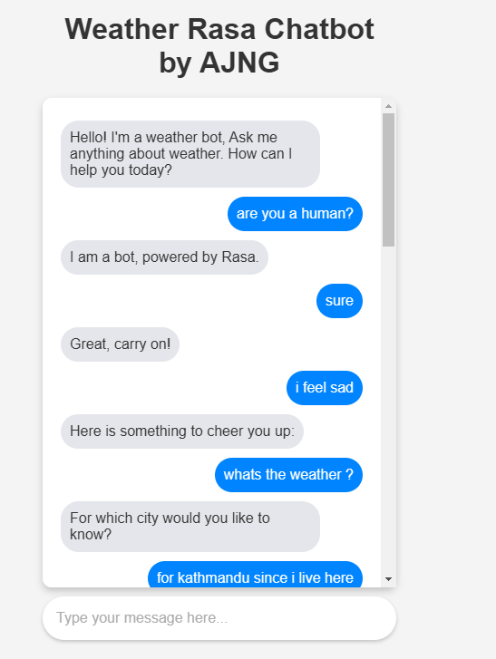
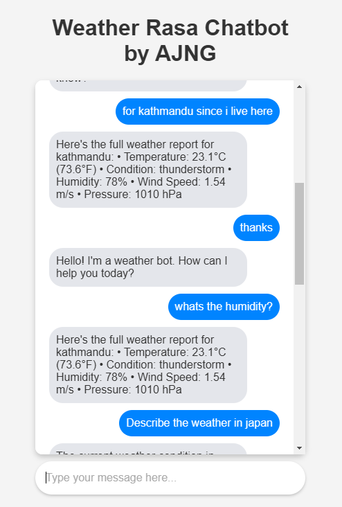
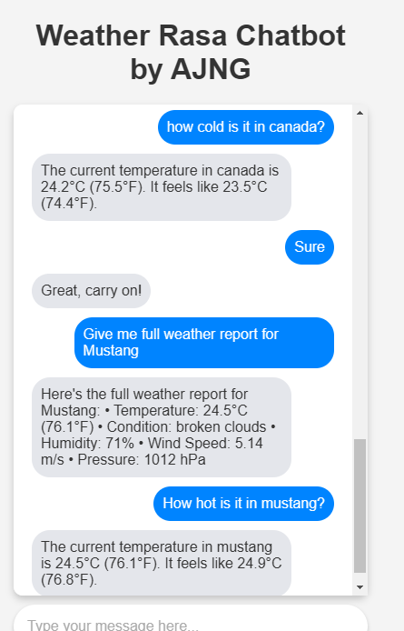

# Weather Bot

This is a weather bot built using Rasa, a popular open-source conversational AI framework. The bot is designed to provide users with information about the weather in different cities, including temperature, humidity, wind, and weather description.

## Features

The bot supports the following intents:

- `greet`: The user greets the bot.
- `goodbye`: The user says goodbye to the bot.
- `ask_weather`: The user asks about the weather.
- `inform_city`: The user specifies the city they want to know the weather for.
- `ask_temperature`: The user asks for the temperature.
- `ask_humidity`: The user asks for the humidity.
- `ask_wind`: The user asks for the wind information.
- `ask_weather_description`: The user asks for the weather description.
- `ask_full_weather_report`: The user asks for a full weather report.
- `user_feels_sad`: The user expresses feeling sad.
- `affirm`: The user affirms something.
- `bot_challenge`: The user challenges the bot.

The bot uses the OpenWeatherMap API to fetch the weather data for the specified city.

## Installation

1. Clone the repository:

```
git clone https://github.com/your-username/weather-bot.git
```

2. Install the required dependencies:

```
pip install -r requirements.txt
```

3. Obtain an API key from OpenWeatherMap and set it as an environment variable:

```
OPENWEATHERMAP_API_KEY=your-api-key
```

4. Run the Rasa server:

```
rasa run --enable-api --cors "*"
```

5. Run the Flask server:

```
python index.py
```

The bot should now be running and ready to answer your weather-related questions.

## Usage

You can interact with the bot through the web interface at `http://localhost:5000/`. You can also use the Rasa API to interact with the bot programmatically.

Here are some example interactions:

```
User: Hello
Bot: Hello! I'm a weather bot. How can I help you today?

User: What's the weather like in New York?
Bot: The current temperature in New York is 20.0°C (68.0°F). It feels like 18.5°C (65.3°F).

User: What's the humidity?
Bot: The current humidity in New York is 60%.

User: What about the wind?
Bot: In New York, the wind speed is 5 m/s, and the direction is 270°.

User: Can you give me the full weather report for London?
Bot: Here's the full weather report for London:
• Temperature: 15.0°C (59.0°F)
• Condition: broken clouds
• Humidity: 70%
• Wind Speed: 7 m/s
• Pressure: 1020 hPa

User: That's great, thanks!
Bot: Did that help you?

User: Yes, it did. Goodbye!
Bot: Goodbye! Have a great day!
```

## Screenshots

Here are some screenshots of the weather bot in action:


*Weather Bot Homepage*


*Weather Information*


*Full Weather Report*

## Contact Me

If you have any questions or feedback, feel free to reach out to me:

- Email: [ajngworks@gmail.com]

I'd be happy to assist you or discuss any improvements or new features you'd like to see in the weather bot.